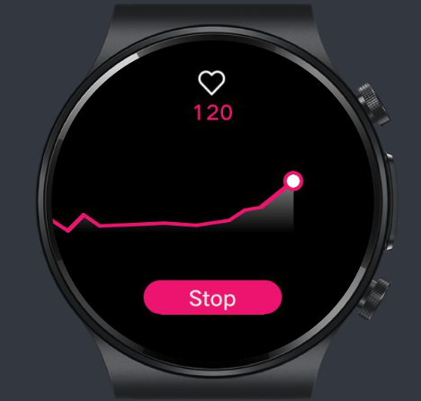

# Lite Wearable Sample Code 

This repository hosts a basic sample code for HarmonyOS Lite Wearables. 
The app allows users to monitor their heart rate (HR) and see its evolution on a graph.




## What you can find

The example is implemented as a unique page based on feature abilities (FA) using JavaScript APIs.

Compatible with __HarmonyOS SDK 2.2.0 (API 6)__, and supports __SDK 3.0.0 (API 7)__.

In the code, you can check the controls for conditional rendering and state properties binding (i.e., in `pages/index/index.hml`):

````html
<div class="reading-animation" if="{{readingHR}}" >
    <image-animator class="heart" ref="animator" images="{{heartFrames}}" duration="0.4s" />
    <text class="hr" >{{hr}}</text>
</div>
````

In the logic of the app (i.e., `pages/index/index.js`), you can check how to subscribe to sensor changes, like the HR and _on-body_ sensors:

````javascript
sensor.subscribeHeartRate({
    success: function(ret) {
        // Every time a change is detected, updates the buffer and chart
        console.debug(`Got HR value: ${ret.heartRate}`);
    },
    fail: function(data, code) {
        console.error(`[subscribeHR()] Subscription failed. Code = ${code}, Data = ${data}`);
    },
});
````

Also some functions that use the local device filesystem (i.e., write, list, and read files).

In the `/config.json` file, you can find how to declare permissions to use powerful features. 

## Quick start 

1. Clone this repository to access the code locally.
2. Download the latest version of the [DevEco Studio IDE](https://developer.harmonyos.com/en/develop/deveco-studio).
3. Load the project in the IDE and get the dependencies.
4. Test it on the built-in Huawei Lite Wearable Simulator (in the IDE). 
5. Test the app on a real device (see this [blog post](https://medium.com/huawei-developers/harmony-os-prepare-your-lite-wearable-project-for-integration-b4daaa9df67e) for more info)

You can improve the code as you wish. Have a look at the official [development documentation for lite wearables](https://developer.harmonyos.com/en/docs/documentation/doc-references/lite-wearable-general-rules-0000001176909956).


